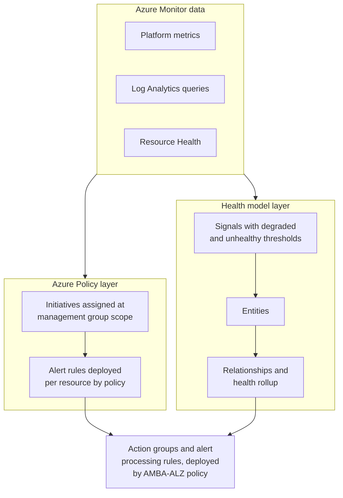
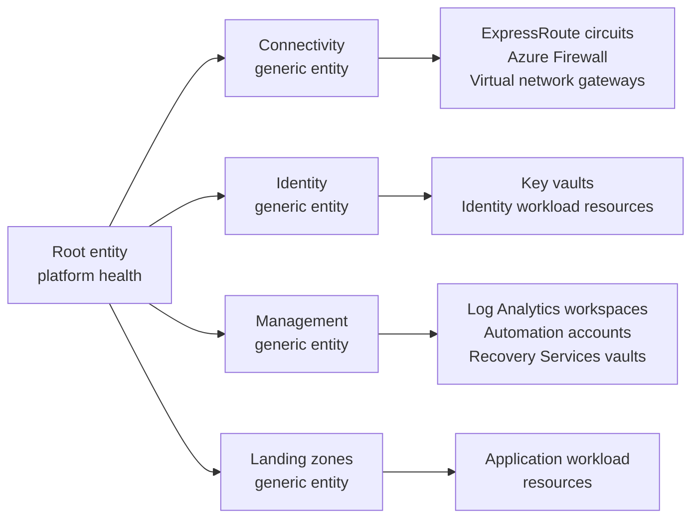

> [!important]
> [Azure Monitor health models](https://learn.microsoft.com/en-us/azure/azure-monitor/health-models/overview) are in public preview. Every documented API version carries a `-preview` suffix. This page is a first-pass design discussion, not a supported AMBA-ALZ feature and not a commitment to build one. Nothing described here ships in this repository today.

### In this page

> [Overview](../Health-Models-Migration-Path#overview)  
> [What AMBA-ALZ provides today](../Health-Models-Migration-Path#what-amba-alz-provides-today)  
> [What a health model adds](../Health-Models-Migration-Path#what-a-health-model-adds)  
> [Why the two are complementary](../Health-Models-Migration-Path#why-the-two-are-complementary)  
> [Mapping AMBA concepts to health model concepts](../Health-Models-Migration-Path#mapping-amba-concepts-to-health-model-concepts)  
> [Phased migration path](../Health-Models-Migration-Path#phased-migration-path)  
> [What stays owned by policy](../Health-Models-Migration-Path#what-stays-owned-by-policy)  
> [A possible future shape](../Health-Models-Migration-Path#a-possible-future-shape)  
> [Open questions and known gaps](../Health-Models-Migration-Path#open-questions-and-known-gaps)  
> [References](../Health-Models-Migration-Path#references)  

## Overview

AMBA-ALZ answers the question "what should we alert on, and how do we get those alerts deployed everywhere". Azure Monitor health models answer a different question: "given everything we are already collecting, what is the current state of this workload, and which part of it is broken".

A health model does not replace the alert rules AMBA-ALZ deploys. It reads the same Azure Monitor data those alert rules read, and adds an entity graph on top so that many individual signals resolve into one health state per component. Microsoft describes the intent as moving "away from resource-centric alerting and alert fatigue towards health-based alerting that represents the actual state of your workload".

The sections below map AMBA-ALZ constructs onto health model constructs, propose a phased path for adopting health models without giving up policy-driven alerting at scale, and list the gaps that have no answer yet.

## What AMBA-ALZ provides today

AMBA-ALZ is a policy-driven alert deployment system scoped to the Azure Landing Zones management group hierarchy.

- **Alert definitions.** The `services/` directory holds 78 `alerts.yaml` files across 49 Azure service folders, defining 612 metric alerts, 47 log search alerts, 15 activity log alerts and one modify-policy entry, `Backup Health Monitoring`. Most metric entries carry a metric namespace, static threshold, operator, aggregation, window size and severity. 33 use `DynamicThresholdCriterion` and carry a sensitivity instead of a threshold. Log entries carry a query and the same evaluation properties but no metric namespace. Activity log entries carry neither a threshold nor an aggregation, because they match events rather than sample values.
- **Policy definitions.** `patterns/alz/policyDefinitions/` contains 11 `policies-*.json` files holding 143 policy definitions between them, covering Automation, Compute, Hybrid, KeyManagement, Monitoring, Network, NotificationAssets, RecoveryServices, ServiceHealth, Storage and Web.
- **Alert resource types deployed.** The policies deploy `Microsoft.Insights/metricAlerts`, `Microsoft.Insights/scheduledQueryRules` and `Microsoft.Insights/activityLogAlerts`, plus `Microsoft.Insights/actionGroups` and `Microsoft.AlertsManagement/actionRules` for notification routing.
- **Initiatives and assignments.** 17 initiatives in `patterns/alz/policySetDefinitions/` are assigned through 16 assignment files in `patterns/alz/policyAssignments/`. `patterns/alz/alzArm.json` is a management group scoped deployment template parameterised with `platformManagementGroup`, `IdentityManagementGroup`, `managementManagementGroup`, `connectivityManagementGroup` and `LandingZoneManagementGroup`.
- **Remediation.** Most policy definitions use `DeployIfNotExists`, and 31 of the 143 default to `Disabled` so an operator can switch on only the ones they want. Two Recovery Services definitions use `Modify` instead. Existing resources become non-compliant and are brought into line by remediation tasks, using the Monitoring Policy Contributor role referenced by all 16 assignments. See [Remediate Policies](../../HowTo/deploy/Remediate-Policies).
- **Opt-out by tag.** The `MonitorDisable` tag, with default values `true`, `Test`, `Dev` and `Sandbox`, removes a resource from the scope of alert deployment. See [Disable Policies](../../HowTo/Disabling-Policies).
- **Threshold tuning by tag.** A resource tagged `_amba-<metricName/counterName>-threshold-Override_`, or `_amba-<metricName/counterName>-<differentiator>-threshold-Override_` where the same metric is used more than once, gets a per-resource threshold in place of the initiative-wide default. See [Override alert thresholds](../../HowTo/Threshold-Override).
- **Notification assets.** An action group and an alert processing rule are deployed per subscription into `rg-amba-monitoring-001`, filtered by severity across Sev0 to Sev4, alongside a separate suppression alert processing rule and a dedicated Service Health action group. `BYOActionGroup` and `BYOAlertProcessingRule` let customers supply their own instead. See [Bring Your Own Notifications](../../HowTo/Bring-your-own-Notifications).

The result is a large, consistent, governed population of individual alert rules. None of them says whether a given workload is currently working.

## What a health model adds

A health model is an Azure resource, `Microsoft.CloudHealth/healthmodels`, that holds a graph of entities and the rules that turn monitoring data into a health state for each one.

- **Entities.** Three kinds. A single **root entity** representing the model itself, **Azure resource entities** representing individual Azure resources, and **generic entities** representing anything that is not an Azure resource, such as a business unit, a region or an aggregation point.
- **Signals.** Four signal types are documented: an Azure resource platform metric, a Log Analytics workspace log query, an Azure Monitor workspace PromQL query, and Azure Resource Health. Health models do not collect telemetry. They read what Azure Monitor already collects.
- **Two thresholds per signal.** A signal takes an unhealthy threshold and an optional degraded threshold, so it expresses a gradient rather than a single fire-or-not boundary. Static and dynamic thresholds are both supported.
- **Health states.** `Healthy`, `Degraded`, `Unhealthy` and `Unknown`. An entity takes "the worst state of all its signals".
- **Relationships and rollup.** Entities connect through parent and child relationships. A child's *impact* setting (`Standard`, `Limited`, `Suppressed`) controls how much of its state reaches the parent. A parent's *dependencies* setting (`Worst of`, `Healthy limit`, `Not-healthy limit`) controls how it combines many children. This is how "three of four gateways down is unhealthy, one of four is fine" gets expressed.
- **Discovery.** Entities can be added automatically by an Azure Resource Graph query, from Application Insights topology, or from a service group. Discovery rules run every five minutes, can attach recommended signals for the discovered resource type automatically, and can discover relationships between entities.
- **Alerting on state, not on signal.** Alerts are configured per entity rather than per signal, for the `Degraded` state, the `Unhealthy` state, or both, with up to five action groups each. They use the same action groups as every other Azure Monitor alert.
- **Nesting.** A health model can be added to another health model as a child entity, so separate models per domain or per application can roll up into one all-up view.

## Why the two are complementary

Both systems read the same telemetry, and each covers a gap the other leaves.

Azure Policy operates across a management group hierarchy and enforces a configuration on every subscription that lands under it, now and in the future. A health model has no equivalent, since it is a regular resource in one resource group.

A health model knows that an ExpressRoute circuit, a firewall and a gateway are parts of one connectivity service, and that degrading one of them degrades the service. AMBA-ALZ deploys each alert rule independently of every other one, so it cannot express that.

Both paths converge on the same action groups, so adopting health models does not require a second notification estate. There is no edge between the policy layer and the health model layer because none exists. The two consume the same telemetry independently.

## Mapping AMBA concepts to health model concepts

| AMBA-ALZ construct | Health model equivalent | Notes |
|---|---|---|
| Metric alert (`Microsoft.Insights/metricAlerts`) | Azure resource signal on an entity | Direct equivalent. The metric namespace, metric name and aggregation carry over. |
| Log search alert (`Microsoft.Insights/scheduledQueryRules`) | Log Analytics workspace signal on an entity | Equivalent in principle. The AMBA query shape needs review, see below. |
| Resource Health activity log alert | Azure Resource Health signal on an entity | Equivalent, and simpler. Resource Health is a per-entity toggle rather than a deployed alert rule. |
| Service Health activity log alert | No equivalent | Service Health is a subscription-level activity log event, not one of the four signal types. |
| Monitored Azure resource | Azure resource entity | One resource can appear in several health models, each with independent state. |
| A service made of several resources | Generic entity with child relationships | Has no AMBA-ALZ counterpart at all. This is the capability being added. |
| Policy assignment at a management group | Health model plus discovery rule | Not a scope equivalent. A health model is resource group scoped. |
| ALZ management group archetype | Generic entity per archetype, populated by a discovery rule | The hierarchy becomes topology inside a model rather than scope around it. See below. |
| `MonitorDisable` tag | A `where` clause in the discovery Resource Graph query | Resource Graph discovery supports filtering on tags, so the same tag can drive exclusion. |
| Threshold override tag | No equivalent | See open questions. |
| Alert severity Sev0 to Sev4 | Severity on the per-entity alert rule | Set once per entity per state rather than per alert rule. |
| Action group and alert processing rule | The same action groups | Health model alerts "use the same action groups as other Azure Monitor alerts". |

### Alert rule to signal

The health model designer offers an **Import from alert rules** option that creates "a signal based on existing alert rules that are defined for the Azure resource represented by the entity. The same signal and criteria from the alert rule is used for the new signal." Applied from the alerts documentation, the same option "creates signals based on the alert rule criteria and alert rules based on the alert rule configuration", so it produces a health model alert rule as well as a signal.

The documentation does not state whether the imported signal stays linked to the original alert rule or is a point-in-time copy of its criteria. The observable behaviour points to a copy: Microsoft notes that "Any resource-specific alert rules configured on an Azure resource will continue to operate when that resource is added to a health model, even if health model alerts are enabled. This could result in duplicate alerts for the same underlying issue", and recommends disabling the original rules. This reading should be confirmed against the product before any AMBA-ALZ design depends on it.

On that reading, for AMBA-ALZ:

- A health model does not observe AMBA's deployed alert rules. It observes the same metrics they observe.
- A threshold change made by AMBA, whether from a new release or from a per-resource override tag, would not propagate into an already-created signal.
- Deduplication has to be handled by disabling the resource-scoped rule once its health model signal is trusted.

There is also a shape mismatch. An AMBA alert definition carries at most one threshold, the firing point, and 53 of the 675 entries carry none at all. A health model signal takes two thresholds, of which the unhealthy one is required and the degraded one is optional. An imported AMBA threshold would therefore be expected to fill the unhealthy tier and leave the degraded tier empty, which removes most of the benefit of state-based monitoring. Populating the degraded tier is a judgement AMBA does not currently make.

The **Recommended** option in the designer offers a predefined set of signals and thresholds per resource type. Customers should compare these against the AMBA thresholds for the same resource type before importing anything.

### Resource to entity

An Azure resource entity references a resource by ID, and the resource does not have to live in the same subscription or resource group as the health model. Discovery by Resource Graph query populates entities from the same kind of scope expression AMBA already thinks in, filtered by resource type, subscription, resource group, location or tag.

Turning on **Add recommended signals** on a discovery rule gives every discovered entity baseline monitoring without listing signals per resource, which is the closest thing in the health model world to what an AMBA initiative does.

### Management group and archetype to topology

There is no management group scoped health model. A health model is a resource group scoped resource, so the ALZ hierarchy has to be expressed as topology inside a model rather than as scope around it.

The natural translation is one generic entity per ALZ archetype, with discovery rules populating each one:

Two variants are worth considering. A single platform model with one discovery rule per archetype keeps everything in one graph. Alternatively, one model per archetype nested into a platform model keeps ownership boundaries aligned with the management group boundaries, since nesting rolls a child model's root state up into its parent.

## Phased migration path

Each phase states what must be true before starting it, and what Azure Policy still owns throughout.

### Phase 1, observe alongside

**Entry criteria.** AMBA-ALZ is deployed and remediated, and alerts are flowing to a working action group. A subscription and resource group are available to hold a health model. The identity used by the model has Monitoring Reader on the resources to be represented.

**Steps.** Build one health model over one well-understood service, for example connectivity in a single region. Add signals, but do not enable health model alerts. When an AMBA alert fires, check whether the model reflected it. This is the first strategy Microsoft documents for migrating from resource-specific alert rules.

**Policy still owns.** Everything: all alerting, all notification and all coverage. The health model observes without acting.

### Phase 2, model the critical services

**Entry criteria.** Phase 1 has run long enough to cover at least one real incident, and the entity graph reflected it correctly. Degraded thresholds have been chosen rather than inherited, because an AMBA alert definition has only one threshold slot to inherit from.

**Steps.** Extend the model to the platform services that carry business impact. Introduce generic entities for services that span several resources, and tune the impact and dependencies settings so that redundant components do not report the service as broken. Enable health model alerts on the aggregate entities only, not on individual resource entities. Point them at the existing AMBA action group.

**Policy still owns.** All alert rule deployment and all coverage guarantees. New resources still get AMBA alerts automatically. Notification assets are still policy-deployed.

Duplicate alerts are expected in this phase. Microsoft documents this as the cost of running both, and phase 3 removes it.

### Phase 3, retire the duplicated resource-scoped alerts

**Entry criteria.** Health model alerts have fired correctly, and only correctly, for a full operational cycle on the entities in question. There is an agreed owner for the health model configuration, because from this point it is load bearing.

**Steps.** For the specific resources now covered by trusted health model signals, disable the equivalent AMBA alert rules. AMBA already supports this without editing policy: apply the `MonitorDisable` tag, or set the relevant policy effect to `Disabled` per [Disable Policies](../../HowTo/Disabling-Policies). Prefer these over deleting alert rules by hand, because a remediation run will recreate anything deleted out of band.

**Policy still owns.** Coverage for everything not yet modelled, which is most of the estate, plus Service Health alerting, the notification assets and the compliance view that proves alerting exists.

### Phase 4, broaden

**Entry criteria.** Phases 1 to 3 are stable for at least one workload, and the operating model for keeping health models current has been decided, which in practice means discovery rules rather than hand-placed entities.

**Steps.** Repeat per archetype or per landing zone. Use nested health models to keep the per-workload models independently owned while still rolling into a platform view.

**Policy still owns.** The same list as phase 3, at every phase.

## What stays owned by policy

Regardless of how far health model adoption goes, the following do not have a health model equivalent and should stay with Azure Policy.

- **Coverage enforcement.** A health model represents the resources someone put in it, or that a discovery query matched. Only a policy assignment at a management group guarantees that a subscription created next month is monitored.
- **Compliance evidence.** The non-compliant resource count from a policy assignment is an auditable statement that monitoring is configured. A health model has no comparable artefact.
- **Service Health.** Service Health and planned maintenance are activity log events at subscription scope, and are not one of the four health model signal types.
- **Notification asset lifecycle.** Action groups and alert processing rules are still deployed and kept consistent by policy. Health model alerts consume them.
- **Threshold baselines.** The `services/` alert definitions remain the reference for what a sensible threshold is, whether the value ends up in an alert rule or in a signal.

## A possible future shape

> [!note]
> This section is exploratory. It describes what an AMBA-ALZ health model capability could look like based on the resource types Microsoft documents today. It is not on any roadmap, no such policy exists in this repository, and the design has not been reviewed or agreed.

AMBA-ALZ already knows how to provision arbitrary resources at scale through `DeployIfNotExists`, and health models are ordinary ARM resources with a documented Bicep and ARM surface. That suggests a shape that reuses the existing pattern rather than inventing a parallel one.

The building blocks would be:

- A policy definition, assigned at the same management group scopes the existing initiatives use, that deploys a `Microsoft.CloudHealth/healthmodels` resource into the AMBA monitoring resource group in each subscription in scope, alongside the action group and alert processing rule already deployed there.
- A `healthmodels/authenticationsettings` child configuring the managed identity the model uses to read telemetry, which is the same identity concern the existing [Bring Your Own User Assigned Managed Identity](../../HowTo/Bring-your-own-Managed-Identity) guidance already deals with.
- One `healthmodels/discoveryrules` child per ALZ archetype, each a Resource Graph query filtered to the resource types that archetype's initiative already targets, with `MonitorDisable` expressed as a tag exclusion in the query so a single tag keeps governing both alert deployment and model membership.
- `healthmodels/relationships` children rooting each archetype's discovered entities under the model root, producing the topology sketched earlier.
- Signal thresholds sourced from the same `services/` alert definitions that already drive the metric alerts, with the AMBA threshold populating the unhealthy tier and a degraded tier that would have to be introduced.

Three questions in that sketch stay open: what the degraded thresholds should be, whether one model per subscription or one per archetype is the right granularity, and how long health model alerts and AMBA alert rules can coexist before they produce the alert fatigue health models exist to remove.

## Open questions and known gaps

- **Scope mismatch.** A health model is a resource group scoped resource. AMBA-ALZ governs a management group hierarchy. There is no documented management group scoped health model, so the hierarchy has to be reproduced as entity topology and kept in step by hand or by discovery. No page documents what becomes of a model when a subscription moves between management groups.
- **No documented scale limits.** No published page states a maximum number of entities per model, signals per entity or relationships per model. Without those numbers it is not possible to say whether a landing zone wide model is viable, or where nesting becomes mandatory rather than stylistic.
- **The threshold override tag has no equivalent.** AMBA's per-resource threshold override works because policy re-evaluates the tag and rewrites the alert rule. If an imported signal is a point-in-time copy of the alert criteria, as the documented duplicate-alert behaviour suggests, a tag change does not reach it. Customers relying on override tags would lose that mechanism when the corresponding alert moves into a health model, with no documented replacement. Confirming the import behaviour is the first open item here.
- **The degraded tier has no source.** An AMBA alert definition carries at most one threshold. A health model signal has room for two, and the degraded one has no AMBA counterpart. Filling it is new judgement that neither this repository nor the health model recommended signals currently supply.
- **No Service Health equivalent.** Service Health, planned maintenance and security advisory alerts are activity log based and cannot currently become health model signals. These stay with policy indefinitely unless the signal types are extended.
- **Log search alert queries need rework.** AMBA log search alerts embed a threshold placeholder and a Resource Graph correlation to resolve the override tag at query time, as described in [Override alert thresholds](../../HowTo/Threshold-Override). A Log Analytics signal returns a value to be compared against the model's own thresholds, so that machinery would have to be removed rather than ported.
- **Duplicate alerting during transition.** Microsoft documents that resource-scoped alert rules keep firing after a resource joins a health model. There is no documented way to suppress one from the other, so the overlap has to be managed by disabling rules on a schedule the operator controls.
- **No published pricing or regional availability.** Neither the Azure Monitor pricing page nor the health models documentation states a cost model, and no supported-regions list was found, although the resource requires a location. Both are needed before any at-scale deployment can be planned.
- **Preview status.** All documented API versions are `-preview`. No generally available version exists. Any AMBA-ALZ work in this direction would be building on a moving surface.
- **No Microsoft guidance connects the two.** Neither the health models documentation nor the Cloud Adoption Framework management and monitoring design area mentions the other. The mappings above are therefore derived rather than sourced from published guidance.

## References

Azure Monitor health models documentation, checked against the live pages:

- [Health models in Azure Monitor (preview)](https://learn.microsoft.com/en-us/azure/azure-monitor/health-models/overview)
- [Health model concepts](https://learn.microsoft.com/en-us/azure/azure-monitor/health-models/concepts)
- [Signals in Azure Monitor health models](https://learn.microsoft.com/en-us/azure/azure-monitor/health-models/signals)
- [Alerts in Azure Monitor health models](https://learn.microsoft.com/en-us/azure/azure-monitor/health-models/alerts)
- [Discoveries in Azure Monitor health models](https://learn.microsoft.com/en-us/azure/azure-monitor/health-models/discoveries)
- [Create a health model](https://learn.microsoft.com/en-us/azure/azure-monitor/health-models/create)
- [Configure health rollup](https://learn.microsoft.com/en-us/azure/azure-monitor/health-models/rollup)
- [Designer in Azure Monitor health models](https://learn.microsoft.com/en-us/azure/azure-monitor/health-models/designer)

Resource provider reference:

- [Microsoft.CloudHealth/healthmodels](https://learn.microsoft.com/en-us/azure/templates/microsoft.cloudhealth/healthmodels)
- [Microsoft.CloudHealth/healthmodels/entities](https://learn.microsoft.com/en-us/azure/templates/microsoft.cloudhealth/healthmodels/entities)
- [Microsoft.CloudHealth/healthmodels/signaldefinitions](https://learn.microsoft.com/en-us/azure/templates/microsoft.cloudhealth/healthmodels/signaldefinitions)
- [Microsoft.CloudHealth/healthmodels/relationships](https://learn.microsoft.com/en-us/azure/templates/microsoft.cloudhealth/healthmodels/relationships)
- [Microsoft.CloudHealth/healthmodels/discoveryrules](https://learn.microsoft.com/en-us/azure/templates/microsoft.cloudhealth/healthmodels/discoveryrules)
- [Microsoft.CloudHealth/healthmodels/authenticationsettings](https://learn.microsoft.com/en-us/azure/templates/microsoft.cloudhealth/healthmodels/authenticationsettings)
- [az monitor health-models](https://learn.microsoft.com/en-us/cli/azure/monitor/health-models)

Related AMBA-ALZ pages:

- [The Azure Landing Zones (ALZ) Pattern](../ALZ-Pattern)
- [Override alert thresholds](../../HowTo/Threshold-Override)
- [Disable Policies](../../HowTo/Disabling-Policies)
- [Bring Your Own Notifications](../../HowTo/Bring-your-own-Notifications)
- [Remediate Policies](../../HowTo/deploy/Remediate-Policies)
